#Looped App

A single-page app for sharing city tips. Uses Facebook Oauth, Backbone, and Rails with a Postgres DB.

Check it out: <a href="https://looped.herokuapp.com/">here!</a>

##Features

- A user logs in to the app via Facebook, to access their basic profile info (name & photo), and friend list

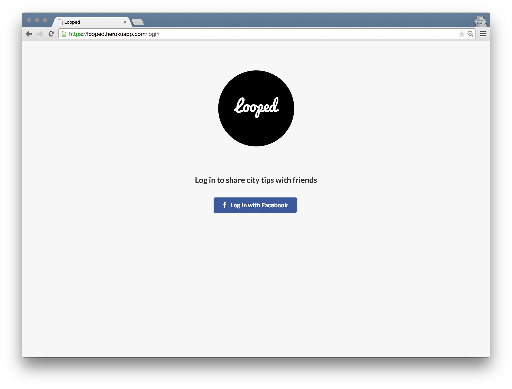

- A user can view all tip results by city.

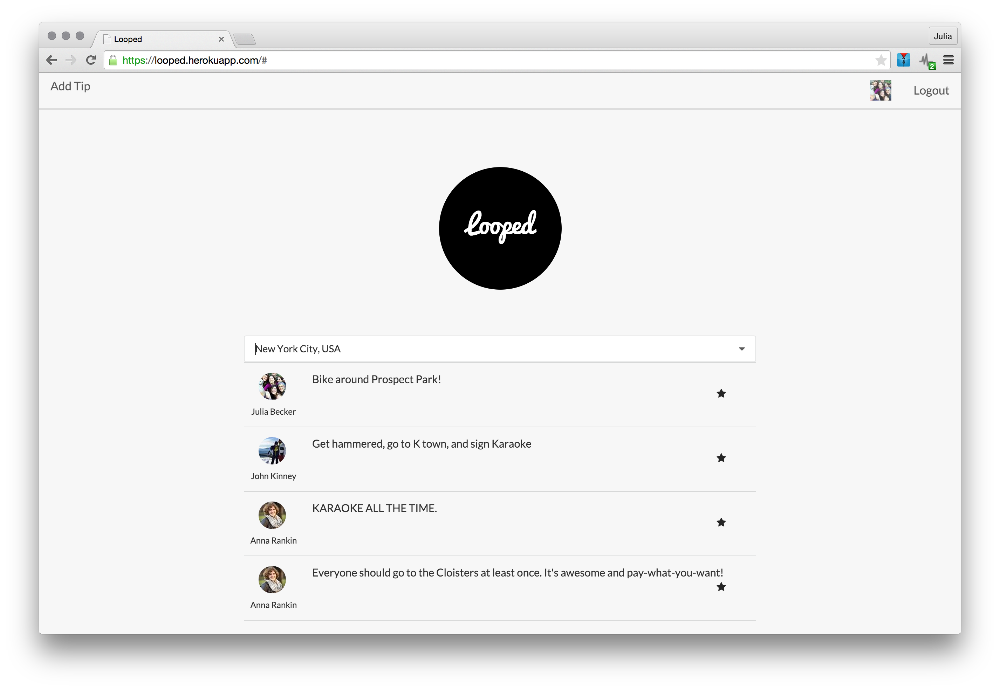

- A user can add a new tip to the app (including adding a new city if it doesn't exist).

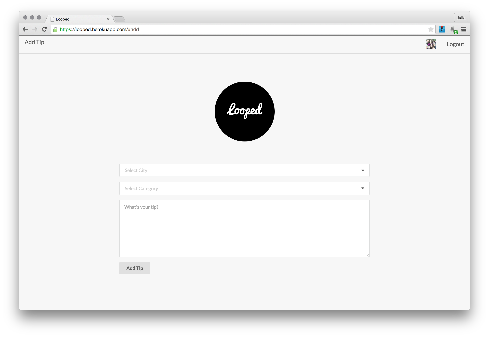

- A user can favorite an individual tip to save it for later, and view those favorited tips in their user profile.

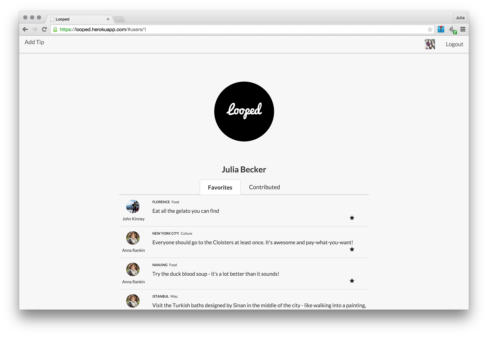

- A user can see all of the tips they have contributed in their user profile.

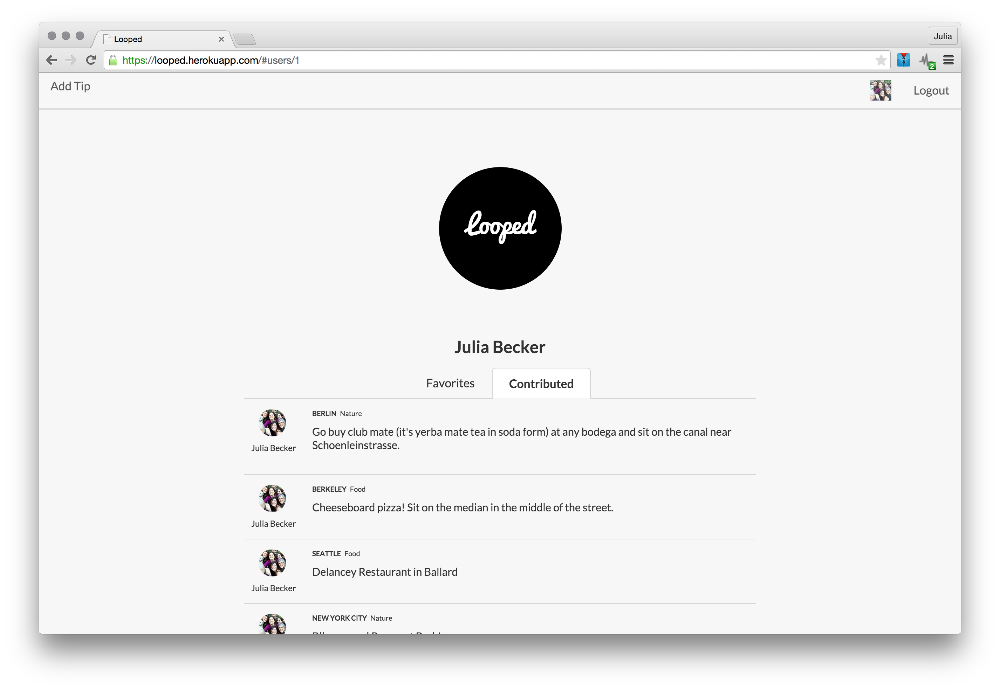

##Wireframes

- Facebook login

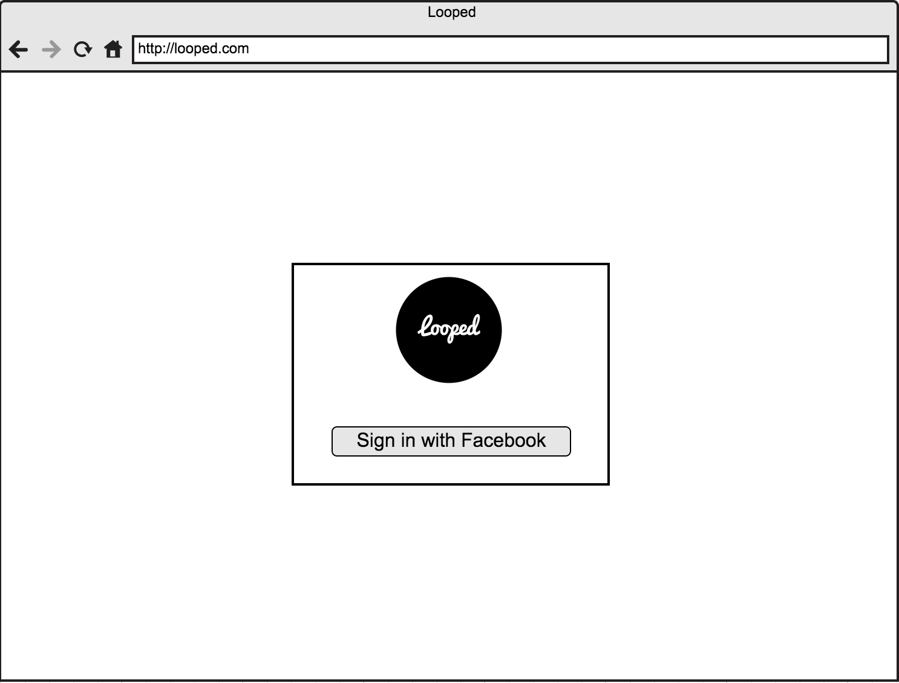

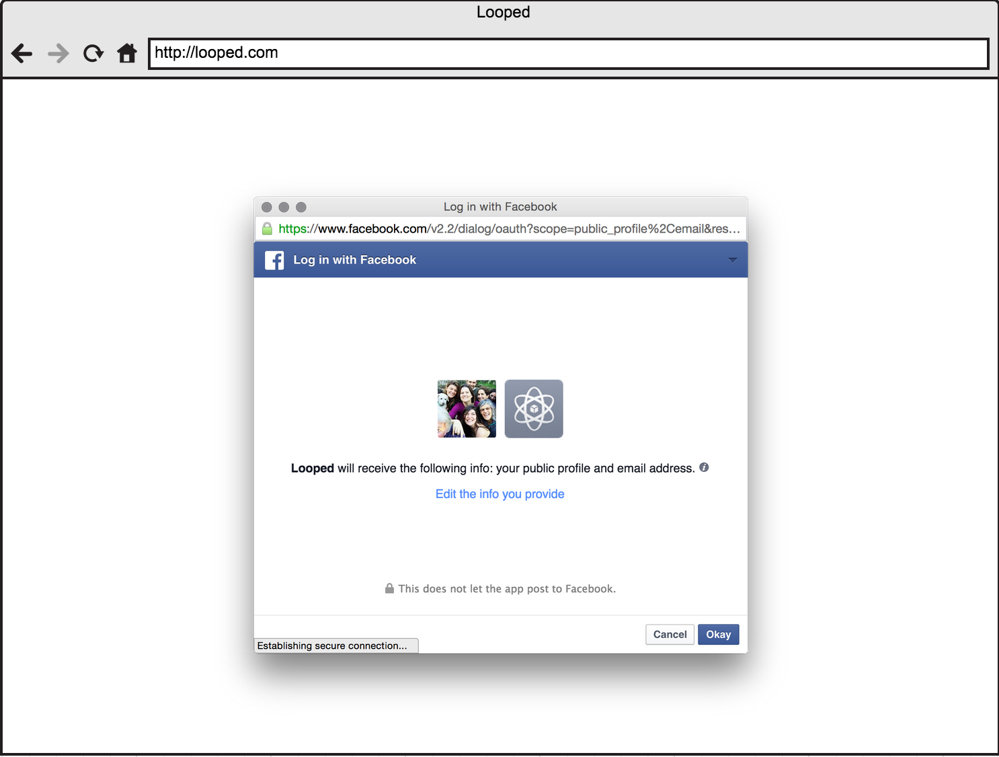

- Homepage / city results

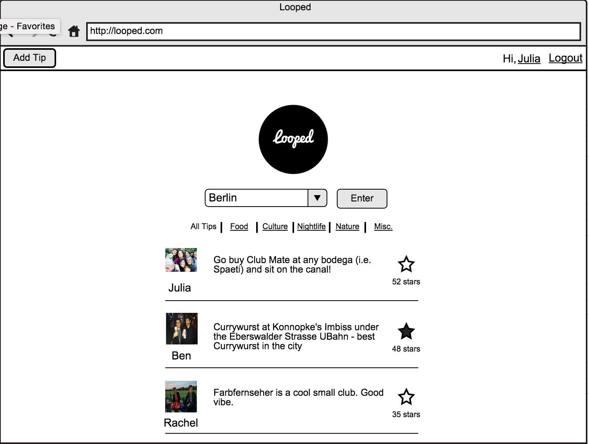

- Profile favorites

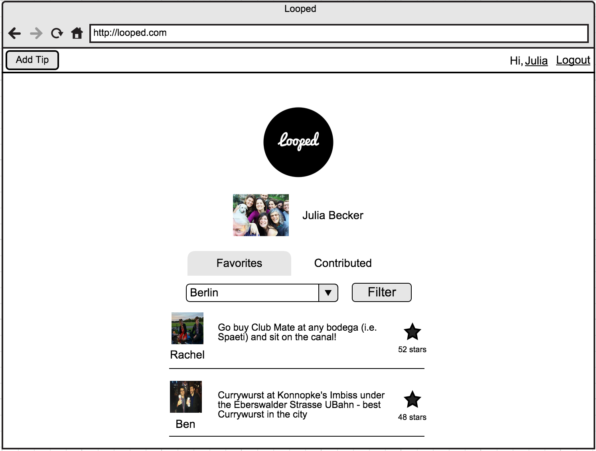

- Profile contributed

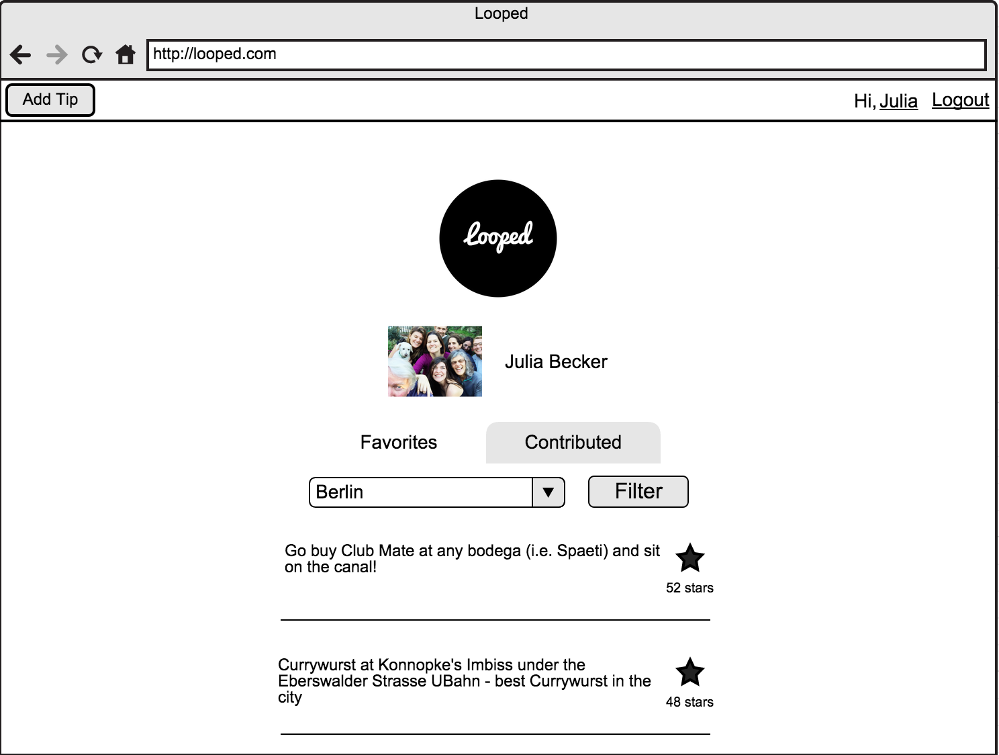

- Add tip

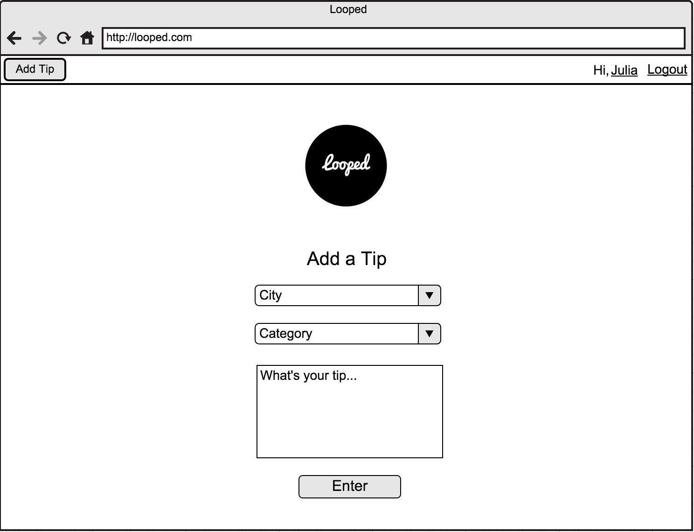

##ERD

##Dependencies

- **Rails**
- **Backbone JS**
- **Postgres**
- **Underscore JS**
- **jQuery**
- **Semantic UI**
- **HTTParty**
